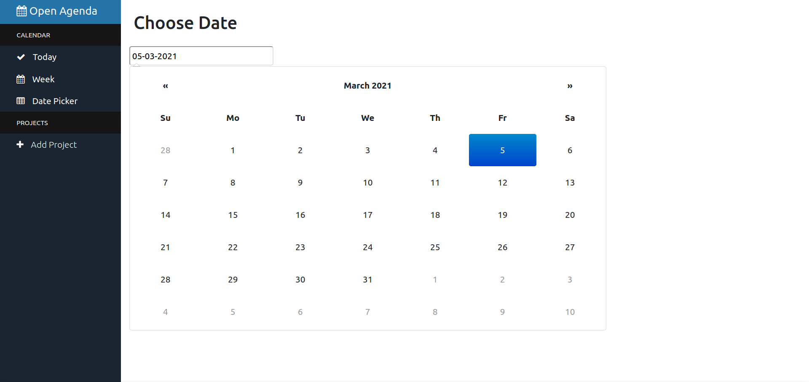

# open-agenda
Simple markdown agenda for taking notes. Simple and easy to configure. Written with Django.

## Features
- Take note with markdown
- Weekly view and date picking
- Add project





## To-Do
- [x] Projects
- [ ] Settings Page
- [ ] Export agenda

## Installation
```shell
git clone https://github.com/m8/open-agenda
cd open-agenda
pip3 install pipenv
pipenv shell
python3 open-agenda/manage.py runserver
```